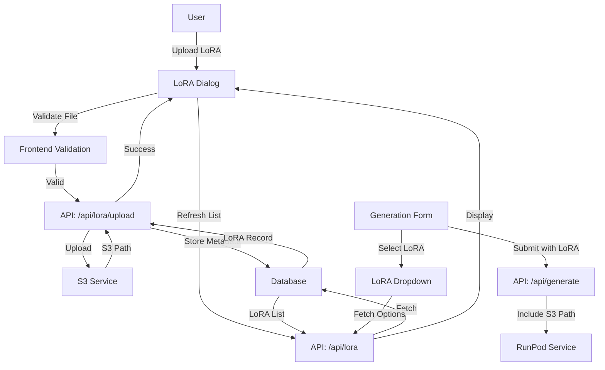

# Design Document: LoRA Management System

## Overview

This system enables users to upload, manage, and utilize LoRA (Low-Rank Adaptation) models for WAN 2.2 video generation. The design focuses on seamless integration with the existing video generation workflow while providing robust file management capabilities through S3 storage.

The system consists of three main components:
1. **LoRA Management Dialog** - A dedicated interface for uploading, viewing, and deleting LoRA files
2. **LoRA Selection in Generation Form** - Integration with the WAN 2.2 video generation form
3. **Backend Services** - API routes and database models for LoRA management

## Architecture

### Component Hierarchy

```
VideoGenerationForm (existing)
├── LoRA Selection Dropdown (new)
│   └── Manage LoRAs Button → Opens LoRA Dialog
│
LoRA Management Dialog (new)
├── Upload Section
│   ├── File Input (drag & drop)
│   └── Upload Progress
├── LoRA List Section
│   └── LoRA Item Cards
│       ├── Thumbnail/Icon
│       ├── Metadata (name, size, date)
│       └── Delete Button
└── Close Button
```

### Data Flow



## Components and Interfaces

### 1. LoRA Management Dialog Component

**Location**: `src/components/lora/LoRAManagementDialog.tsx`

**Props**:
```typescript
interface LoRAManagementDialogProps {
  open: boolean;
  onOpenChange: (open: boolean) => void;
  onLoRAUploaded?: () => void; // Callback to refresh LoRA list in parent
}
```

**State**:
```typescript
interface LoRADialogState {
  loras: LoRAFile[];
  isUploading: boolean;
  uploadProgress: number;
  isLoading: boolean;
  error: string | null;
  deleteConfirmId: string | null;
}
```

**Key Features**:
- File upload with drag & drop support
- Real-time upload progress indicator
- LoRA list with search/filter capabilities
- Delete confirmation dialog
- Responsive grid layout for LoRA cards

### 1.5. LoRA Selector Component

**Location**: `src/components/lora/LoRASelector.tsx`

**Props**:
```typescript
interface LoRASelectorProps {
  value: string; // S3 path of selected LoRA
  onChange: (value: string) => void;
  label: string;
  description?: string;
  availableLoras: LoRAFile[];
  onManageClick: () => void;
}
```

**State**:
```typescript
interface LoRASelectorState {
  isDropdownOpen: boolean;
  searchQuery: string;
  selectedLoRA: LoRAFile | null;
}
```

**Key Features**:
- Visual card display for selected LoRA
- Searchable dropdown with LoRA previews
- Quick actions: Change, Clear, Manage
- Empty state with clear call-to-action
- Recent LoRAs section in dropdown
- Keyboard navigation support

### 2. LoRA Selection Component

**Location**: New component `src/components/lora/LoRASelector.tsx` + Integration into `VideoGenerationForm.tsx`

**Model Configuration Approach**:
Use a custom parameter type `lora-selector` to identify LoRA parameters:

```typescript
// In modelConfig.ts - wan22 model
parameters: [
  // ... existing parameters
  { 
    name: 'lora_high', 
    label: 'High LoRA', 
    type: 'lora-selector', // Custom type for special rendering
    default: '', 
    group: 'advanced',
    description: 'LoRA model for high-level features'
  },
  { 
    name: 'lora_low', 
    label: 'Low LoRA', 
    type: 'lora-selector',
    default: '', 
    group: 'advanced',
    description: 'LoRA model for low-level features'
  },
]

// For simpler models like flux-krea
parameters: [
  // ... existing parameters
  { 
    name: 'lora', 
    label: 'LoRA Model', 
    type: 'lora-selector',
    default: '', 
    group: 'advanced'
  },
]
```

**LoRASelector Component**:
```typescript
interface LoRASelectorProps {
  value: string; // S3 path of selected LoRA
  onChange: (value: string) => void;
  label: string;
  description?: string;
}
```

**Enhanced UI Structure**:
```
┌─────────────────────────────────────────┐
│  High LoRA                               │
│  ┌─────────────────────────────────────┐│
│  │ [📦 Icon] model_name.safetensors    ││
│  │           2.3 GB • Uploaded 2d ago  ││
│  │           [Change] [Clear] [Manage] ││
│  └─────────────────────────────────────┘│
│                                          │
│  [No LoRA selected]                      │
│  ┌─────────────────────────────────────┐│
│  │ [+] Select LoRA          [Manage]   ││
│  └─────────────────────────────────────┘│
└─────────────────────────────────────────┘
```

**Features**:
- **Visual Card Display**: Shows selected LoRA with icon, name, size, and upload date
- **Quick Actions**: Change, Clear, and Manage buttons
- **Empty State**: Clear call-to-action when no LoRA selected
- **Dropdown with Preview**: When clicking "Change", shows dropdown with LoRA previews
- **Search/Filter**: Search LoRAs by name in dropdown
- **Recent LoRAs**: Show recently used LoRAs at the top

**Addition to Form**:
```typescript
// New state in VideoGenerationForm
const [showLoRADialog, setShowLoRADialog] = useState(false);
const [availableLoras, setAvailableLoras] = useState<LoRAFile[]>([]);

// Fetch LoRAs on mount and when dialog closes
useEffect(() => {
  if (hasLoRAParameter(currentModel)) {
    fetchAvailableLoras();
  }
}, [currentModel, showLoRADialog]);

// Custom rendering for lora-selector type
const renderParameter = (param: ModelParameter) => {
  if (param.type === 'lora-selector') {
    return (
      <LoRASelector
        value={parameterValues[param.name] || ''}
        onChange={(value) => handleParameterChange(param.name, value)}
        label={param.label}
        description={param.description}
        availableLoras={availableLoras}
        onManageClick={() => setShowLoRADialog(true)}
      />
    );
  }
  // ... existing parameter rendering
};
```

**Benefits of this approach**:
- **Better UX**: Visual card display instead of plain dropdown
- **Flexible**: Supports multiple LoRA parameters per model (high/low)
- **Consistent**: Still uses modelConfig system
- **Reusable**: LoRASelector component can be used in other forms
- **Informative**: Shows LoRA metadata at a glance

### 3. Backend API Routes

#### `/api/lora` (GET)
**Purpose**: Fetch all LoRAs for the current workspace

**Response**:
```typescript
{
  success: boolean;
  loras: Array<{
    id: string;
    name: string;
    fileName: string;
    s3Path: string;
    s3Url: string;
    fileSize: number;
    uploadedAt: string;
    workspaceId: string;
  }>;
}
```

#### `/api/lora/upload` (POST)
**Purpose**: Upload a new LoRA file

**Request**: FormData
- `file`: LoRA file (.safetensors or .ckpt)
- `workspaceId`: Current workspace ID

**Response**:
```typescript
{
  success: boolean;
  lora: {
    id: string;
    name: string;
    s3Path: string;
    s3Url: string;
  };
  error?: string;
}
```

#### `/api/lora/[id]` (DELETE)
**Purpose**: Delete a LoRA file

**Response**:
```typescript
{
  success: boolean;
  error?: string;
}
```

## Data Models

### Database Schema (Prisma)

```prisma
model LoRA {
  id          String   @id @default(uuid())
  name        String
  fileName    String
  s3Path      String   // Path in S3 bucket
  s3Url       String   // Full S3 URL
  fileSize    BigInt   // File size in bytes
  extension   String   // .safetensors or .ckpt
  workspaceId String?
  workspace   Workspace? @relation(fields: [workspaceId], references: [id], onDelete: Cascade)
  uploadedAt  DateTime @default(now())
  updatedAt   DateTime @updatedAt

  @@index([workspaceId])
  @@index([uploadedAt])
}
```

### TypeScript Interfaces

```typescript
// Frontend types
interface LoRAFile {
  id: string;
  name: string;
  fileName: string;
  s3Path: string;
  s3Url: string;
  fileSize: number;
  extension: string;
  uploadedAt: string;
  workspaceId?: string;
  lastUsed?: string; // For "Recent" section
}

interface LoRAUploadRequest {
  file: File;
  workspaceId?: string;
}

interface LoRAValidationResult {
  valid: boolean;
  error?: string;
}

// Model config extension
type ModelParameterType = 'string' | 'number' | 'boolean' | 'select' | 'lora-selector';

interface ModelParameter {
  // ... existing fields
  type: ModelParameterType;
  // ... rest of fields
}
```

## Correctness Properties

*A property is a characteristic or behavior that should hold true across all valid executions of a system-essentially, a formal statement about what the system should do. Properties serve as the bridge between human-readable specifications and machine-verifiable correctness guarantees.*

### Property 1: File extension validation
*For any* file upload attempt, only files with .safetensors or .ckpt extensions should be accepted by the validation function
**Validates: Requirements 1.2, 6.1**

### Property 2: File size validation
*For any* file upload attempt, files exceeding 5GB should be rejected by the validation function
**Validates: Requirements 1.2, 6.2**

### Property 3: Upload creates both S3 file and database record
*For any* valid LoRA file upload, the system should create both an S3 object and a corresponding database record with matching identifiers
**Validates: Requirements 1.3**

### Property 4: LoRA list displays all uploaded files
*For any* set of uploaded LoRA files in a workspace, the LoRA management dialog should display all files with their complete metadata (name, size, date)
**Validates: Requirements 2.1, 2.4**

### Property 5: LoRA list refresh fetches latest data
*For any* state of the LoRA list, refreshing should fetch and display the current database state, including any newly added LoRAs
**Validates: Requirements 2.3**

### Property 6: Deletion removes from both S3 and database
*For any* LoRA file, confirming deletion should remove both the S3 object and the database record
**Validates: Requirements 3.2**

### Property 7: LoRA selection populates all available LoRAs
*For any* workspace with uploaded LoRAs, models with a `lora` parameter should have their dropdown options populated with all LoRAs belonging to that workspace
**Validates: Requirements 4.2**

### Property 8: Form state updates with LoRA selection
*For any* LoRA selected from the dropdown, the form state should update to include the selected LoRA's identifier
**Validates: Requirements 4.3**

### Property 9: Generation request includes LoRA path
*For any* form submission with a selected LoRA, the API request payload should include the LoRA's S3 path
**Validates: Requirements 4.4**

### Property 10: New LoRA upload updates selection list
*For any* new LoRA uploaded through the management dialog, the generation form's LoRA selection list should automatically include the new LoRA
**Validates: Requirements 5.3**

### Property 11: Workspace association
*For any* LoRA upload, the database record should be associated with the current workspace ID
**Validates: Requirements 6.4**

### Property 12: Presigned URL expiration
*For any* presigned URL generated for S3 access, the URL should have an expiration time set
**Validates: Requirements 6.5**

## Error Handling

### Client-Side Validation Errors
- **Invalid file extension**: "Please upload a .safetensors or .ckpt file"
- **File too large**: "File size exceeds 5GB limit"
- **No file selected**: "Please select a file to upload"

### Server-Side Errors
- **S3 upload failure**: "Failed to upload file to storage. Please try again."
- **Database error**: "Failed to save LoRA metadata. Please try again."
- **S3 deletion failure**: "Failed to delete file from storage"
- **Database deletion failure**: "Failed to remove LoRA record"
- **Authentication error**: "Invalid S3 credentials"
- **Network timeout**: "Upload timed out. Please check your connection."

### Error Recovery
- Automatic retry for transient S3 errors (using existing S3Service retry logic)
- Rollback mechanism: If S3 upload succeeds but database save fails, delete the S3 file
- User-friendly error messages with actionable guidance
- Error logging for debugging

## Testing Strategy

### Unit Tests

**Frontend Components**:
- LoRA Dialog rendering with empty state
- LoRA Dialog rendering with populated list
- File input validation logic
- Delete confirmation dialog behavior
- Form state management for LoRA selection

**Backend Services**:
- File validation functions
- S3 upload/delete operations (mocked)
- Database CRUD operations (mocked)
- API route handlers

**Example Unit Tests**:
```typescript
describe('LoRA File Validation', () => {
  it('should accept .safetensors files', () => {
    const file = new File([''], 'model.safetensors');
    expect(validateLoRAFile(file).valid).toBe(true);
  });

  it('should reject files over 5GB', () => {
    const file = new File([''], 'large.safetensors');
    Object.defineProperty(file, 'size', { value: 6 * 1024 * 1024 * 1024 });
    expect(validateLoRAFile(file).valid).toBe(false);
  });
});
```

### Property-Based Tests

We will use **fast-check** for property-based testing in TypeScript.

**Property Test Examples**:

```typescript
import fc from 'fast-check';

// Property 1: File extension validation
fc.assert(
  fc.property(
    fc.string().filter(s => s.length > 0),
    fc.oneof(fc.constant('.safetensors'), fc.constant('.ckpt'), fc.string()),
    (name, ext) => {
      const file = new File([''], name + ext);
      const result = validateLoRAFile(file);
      if (ext === '.safetensors' || ext === '.ckpt') {
        return result.valid || result.error !== 'Invalid file extension';
      } else {
        return !result.valid && result.error === 'Invalid file extension';
      }
    }
  ),
  { numRuns: 100 }
);

// Property 3: Upload creates both S3 and database records
fc.assert(
  fc.property(
    fc.record({
      name: fc.string({ minLength: 1, maxLength: 100 }),
      size: fc.integer({ min: 1, max: 5 * 1024 * 1024 * 1024 }),
      ext: fc.oneof(fc.constant('.safetensors'), fc.constant('.ckpt'))
    }),
    async (fileData) => {
      const file = createMockFile(fileData);
      const result = await uploadLoRA(file, 'workspace-123');
      
      // Verify S3 upload
      const s3Exists = await checkS3FileExists(result.s3Path);
      // Verify database record
      const dbRecord = await getLoRAById(result.id);
      
      return s3Exists && dbRecord !== null && dbRecord.s3Path === result.s3Path;
    }
  ),
  { numRuns: 50 }
);
```

### Integration Tests

- Full upload flow: File selection → Validation → S3 upload → Database save → UI update
- Full deletion flow: Delete button → Confirmation → S3 deletion → Database deletion → UI update
- Generation flow: LoRA selection → Form submission → API request with LoRA path
- Dialog interaction: Open dialog → Upload LoRA → Close dialog → Verify form updated

### Test Configuration

- Property-based tests should run a minimum of 100 iterations
- Each test should be tagged with the property number it validates
- Tag format: `// Feature: lora-management, Property X: [property description]`

## UI/UX Design Details

### LoRA Management Dialog

**Layout**:
```
┌─────────────────────────────────────────┐
│  LoRA Management                    [X] │
├─────────────────────────────────────────┤
│  ┌───────────────────────────────────┐  │
│  │  📁 Drag & drop LoRA file here    │  │
│  │     or click to browse            │  │
│  │  (.safetensors, .ckpt, max 5GB)   │  │
│  └───────────────────────────────────┘  │
│                                          │
│  Your LoRAs (3)                          │
│  ┌─────────┐ ┌─────────┐ ┌─────────┐   │
│  │ 📦      │ │ 📦      │ │ 📦      │   │
│  │ model1  │ │ model2  │ │ model3  │   │
│  │ 2.3 GB  │ │ 1.8 GB  │ │ 3.1 GB  │   │
│  │ 2d ago  │ │ 5d ago  │ │ 1w ago  │   │
│  │   [🗑️]  │ │   [🗑️]  │ │   [🗑️]  │   │
│  └─────────┘ └─────────┘ └─────────┘   │
│                                          │
│                          [Close]         │
└─────────────────────────────────────────┘
```

**Visual Design**:
- Card-based layout for LoRA items
- Grid layout (responsive: 1-3 columns based on screen size)
- Hover effects on cards
- Progress bar during upload
- Toast notifications for success/error
- Confirmation dialog for deletion (modal overlay)

### Model Form Integration

**WAN 2.2 Form** (with high/low LoRA):
```
┌─────────────────────────────────────────┐
│  Advanced Settings                       │
│                                          │
│  High LoRA                               │
│  ┌─────────────────────────────────────┐│
│  │ [📦] character_style.safetensors    ││
│  │      2.3 GB • 2 days ago            ││
│  │      [Change] [Clear] [Manage]      ││
│  └─────────────────────────────────────┘│
│                                          │
│  Low LoRA                                │
│  ┌─────────────────────────────────────┐│
│  │ [+] Select LoRA          [Manage]   ││
│  └─────────────────────────────────────┘│
└─────────────────────────────────────────┘
```

**Flux Krea Form** (single LoRA):
```
┌─────────────────────────────────────────┐
│  Advanced Settings                       │
│                                          │
│  LoRA Model                              │
│  ┌─────────────────────────────────────┐│
│  │ [📦] anime_style.safetensors        ││
│  │      1.8 GB • 5 days ago            ││
│  │      [Change] [Clear] [Manage]      ││
│  └─────────────────────────────────────┘│
└─────────────────────────────────────────┘
```

**Interaction Flow**:
1. User opens a model form that supports LoRA
2. In Advanced Settings, sees LoRA selector(s)
3. **If no LoRA selected**: Clicks "[+] Select LoRA" → Opens dropdown with search
4. **If LoRA selected**: Sees card with LoRA info
   - Click "Change" → Opens dropdown to select different LoRA
   - Click "Clear" → Removes LoRA selection
   - Click "Manage" → Opens LoRA management dialog
5. In dropdown: Can search/filter LoRAs, see previews with metadata
6. Selects LoRA → Card updates with selection
7. Submits form → LoRA S3 path included in request payload

**Dropdown UI** (when clicking Change/Select):
```
┌─────────────────────────────────────────┐
│  🔍 Search LoRAs...                     │
├─────────────────────────────────────────┤
│  Recent                                  │
│  ┌─────────────────────────────────────┐│
│  │ [📦] character_style.safetensors    ││
│  │      2.3 GB • 2 days ago            ││
│  └─────────────────────────────────────┘│
│                                          │
│  All LoRAs                               │
│  ┌─────────────────────────────────────┐│
│  │ [📦] anime_style.safetensors        ││
│  │      1.8 GB • 5 days ago            ││
│  └─────────────────────────────────────┘│
│  ┌─────────────────────────────────────┐│
│  │ [📦] realistic_faces.ckpt           ││
│  │      3.1 GB • 1 week ago            ││
│  └─────────────────────────────────────┘│
│                                          │
│  [+ Upload New LoRA]                     │
└─────────────────────────────────────────┘
```

**Model Configuration Examples**:
```typescript
// WAN 2.2 - Multiple LoRAs
{
  id: 'wan22',
  parameters: [
    // ... existing parameters
    { 
      name: 'lora_high', 
      label: 'High LoRA', 
      type: 'lora-selector',
      default: '', 
      group: 'advanced',
      description: 'LoRA for high-level features (character, style)'
    },
    { 
      name: 'lora_low', 
      label: 'Low LoRA', 
      type: 'lora-selector',
      default: '', 
      group: 'advanced',
      description: 'LoRA for low-level features (details, textures)'
    },
  ]
}

// Flux Krea - Single LoRA
{
  id: 'flux-krea',
  parameters: [
    // ... existing parameters
    { 
      name: 'lora', 
      label: 'LoRA Model', 
      type: 'lora-selector',
      default: '', 
      group: 'advanced'
    },
  ]
}
```

### Responsive Design

- **Desktop**: 3-column grid for LoRA cards
- **Tablet**: 2-column grid
- **Mobile**: 1-column grid, full-width dialog
- Touch-friendly buttons (minimum 44x44px)
- Swipe gestures for mobile deletion

## Performance Considerations

### Optimization Strategies

1. **Lazy Loading**: Load LoRA list only when dialog is opened
2. **Pagination**: If LoRA count exceeds 50, implement pagination
3. **Caching**: Cache LoRA list in React state, refresh on upload/delete
4. **Chunked Upload**: For large files, consider chunked upload (future enhancement)
5. **Thumbnail Generation**: Generate thumbnails for visual preview (future enhancement)

### Expected Performance

- LoRA list load: < 500ms
- File validation: < 100ms
- Upload (1GB file): 30-60 seconds (network dependent)
- Delete operation: < 2 seconds
- Form dropdown population: < 200ms

## Security Considerations

### File Validation
- Client-side: Extension and size check before upload
- Server-side: Re-validate extension and size
- MIME type verification (optional, for additional security)

### Access Control
- LoRAs are workspace-scoped
- Users can only access LoRAs in their workspace
- API routes verify workspace ownership

### S3 Security
- Use existing S3Service with authenticated connections
- Presigned URLs with short expiration (1 hour)
- No public read access to LoRA bucket

## Future Enhancements

1. **LoRA Metadata**: Add description, tags, and custom names
2. **LoRA Sharing**: Share LoRAs between workspaces
3. **LoRA Versioning**: Track multiple versions of same LoRA
4. **Thumbnail Preview**: Generate and display LoRA thumbnails
5. **Batch Upload**: Upload multiple LoRAs at once
6. **LoRA Testing**: Test LoRA with sample prompts before using
7. **Usage Analytics**: Track which LoRAs are most used
8. **LoRA Marketplace**: Browse and download community LoRAs
