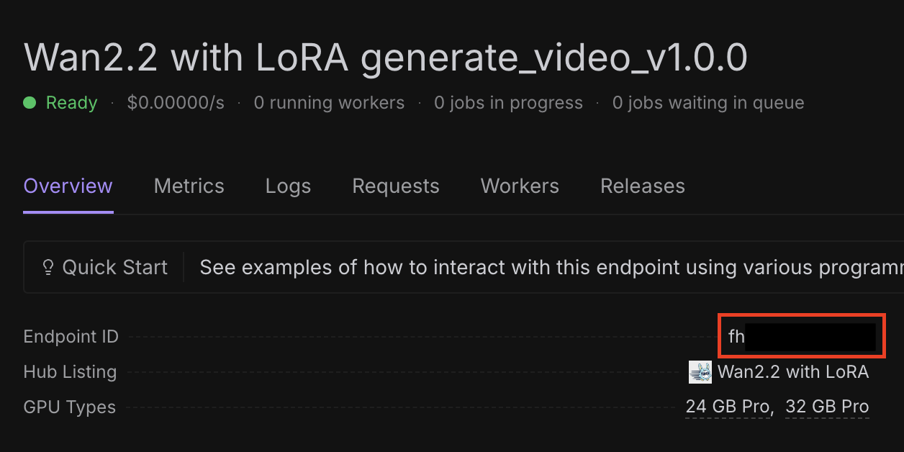
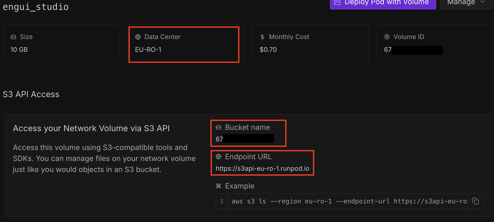
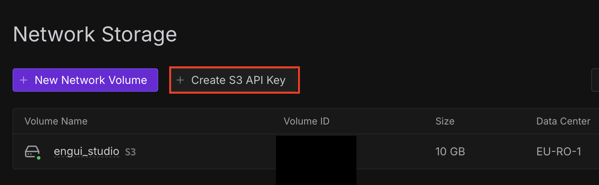
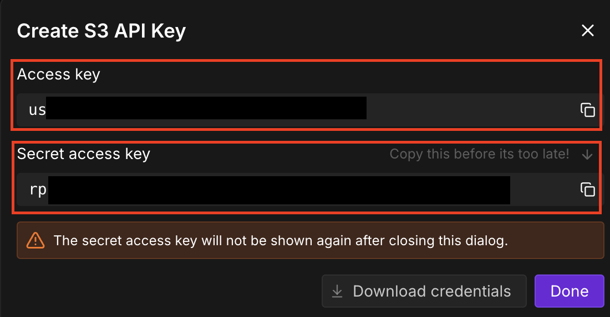

# 🚀 EnguiStudio (은긔 스튜디오)

<div align="center">
  
  
  **다양한 오픈소스 AI 모델을 RunPod Serverless로 쉽게 사용할 수 있는 통합 플랫폼**
  
  *발음: 은긔 스튜디오 (/ɯnɡɯi ˈstjuːdioʊ/)*
</div>

## 🎯 프로젝트 소개

EnguiStudio는 RunPod Serverless 인프라를 활용하여 다양한 오픈소스 AI 모델들을 웹 인터페이스로 쉽게 사용할 수 있게 해주는 플랫폼입니다. 복잡한 설정 없이도 최신 AI 기술을 바로 체험해볼 수 있습니다.

## ✨ 주요 기능 및 빠른 배포

- **🎬 Video Generation**: LoRA 지원이 포함된 WAN 2.2 비디오 생성 모델
  > [](https://console.runpod.io/hub/wlsdml1114/generate_video)
- **✨ FLUX KONTEXT**: 이미지 변환 및 스타일링 모델
  > [](https://console.runpod.io/hub/wlsdml1114/Flux-tontext_Runpod_hub)
- **🎨 FLUX KREA**: LoRA 지원이 포함된 고급 이미지 생성 모델
  > [](https://console.runpod.io/hub/wlsdml1114/Flux-krea_Runpod_hub)
- **🎤 MultiTalk**(권장하지 않음): Audio 2 Video 모델
  > [](https://console.runpod.io/hub/wlsdml1114/Multitalk_Runpod_hub)
- **🎭 Infinite Talk**(권장): 이미지와 오디오를 결합한 말하는 영상 생성 모델
  > [](https://console.runpod.io/hub/wlsdml1114/InfiniteTalk_Runpod_hub)
- **📈 Video Upscale**: AI 기반 비디오 업스케일링
  > [](https://console.runpod.io/hub/wlsdml1114/upscale_interpolation_runpod_hub)
- **⚙️ Unified Settings**: RunPod 엔드포인트를 한 곳에서 관리
- **📚 Library**: 생성된 결과물 관리
- **☁️ S3 Storage**: 파일 관리 및 저장소


## 🚀 빠른 시작

### 처음 실행시킬때는 AWS s3 및 ffmpeg 다운로드 및 설치때문에 실행이 여러번 필요할 수 있습니다!

### 📺 유튜브 튜토리얼
[](https://youtu.be/-0LYseEEx4M)

### ⚡ 초간단 설치법 (권장)

EnguiStudio를 가장 쉽게 시작하는 방법:

#### Windows 사용자
1. **Node.js 다운로드**: [nodejs.org](https://nodejs.org/)에서 다운로드 (LTS 버전)
2. **프로젝트 클론**: 
   ```bash
   git clone https://github.com/wlsdml1114/Engui_Studio.git
   cd Engui_Studio
   ```
3. **설정 스크립트 실행**: `start-windows.bat` 파일을 더블클릭

#### macOS/Linux 사용자
1. **Node.js 설치**: 
   ```bash
   # macOS
   brew install node
   
   # Linux (Ubuntu/Debian)
   sudo apt install nodejs npm
   ```
2. **클론 후 실행**:
   ```bash
   git clone https://github.com/wlsdml1114/Engui_Studio.git
   cd Engui_Studio
   ./start-macos.sh
   ```

**끝!** 스크립트가 자동으로:
- ✅ Node.js 설치 확인
- ✅ 모든 의존성 설치
- ✅ 데이터베이스 설정
- ✅ 프로덕션 버전 빌드
- ✅ 프로덕션 서버 시작
- ✅ 브라우저에서 `http://localhost:3000` 열기


## 초기 설정

#### 1. 설정 페이지 접속
브라우저에서 `/settings` 경로로 이동

#### 2. RunPod 설정
- RunPod API 키 입력
  - RunPod API 키는 [여기](https://console.runpod.io/user/settings)에서 얻을 수 있습니다
- 각 모델별 엔드포인트 ID 설정:
  - RunPod 엔드포인트 ID는 [여기](https://console.runpod.io/serverless)에서 얻을 수 있습니다
    - **Video Generation** (WAN 2.2)
    - **FLUX KONTEXT** (이미지 변환)
    - **FLUX KREA** (이미지 생성)
    - **MultiTalk** (Audio 2 Video)
    - **Infinite Talk** (말하는 영상)
    - **Video Upscale** (비디오 향상)
    - **예시**
    

#### 3. S3 저장소 설정 (권장)
- 파일 관리를 위한 S3 호환 저장소 설정
- 네트워크 볼륨에서 엔드포인트 URL, 액세스 키, 버킷 이름 설정
- 또한 액세스 키 ID와 시크릿 액세스 키를 생성하기 위해 s3 API 키를 생성해야 합니다
- **네트워크 볼륨에서**

- **s3 API 키에서**



#### 4. 저장 및 테스트
- 모든 설정 저장
- 테스트 버튼을 사용하여 연결 확인
- 모든 서비스가 정상 작동하는지 확인


## 🔒 보안 주의사항

- API 키와 시크릿은 웹 인터페이스에서만 입력하고 안전하게 보관
- 로컬에서만 실행하여 개인정보를 보호
- 프로덕션 환경에서는 환경변수를 통한 설정 권장


## 📄 라이선스

이 프로젝트는 MIT 라이선스 하에 배포됩니다. 자세한 내용은 [LICENSE](LICENSE) 파일을 참조하세요.

## 🙏 감사의 말

- [Next.js](https://nextjs.org/) - React 프레임워크
- [RunPod](https://runpod.io/) - AI 인프라 서비스
- [Prisma](https://www.prisma.io/) - 데이터베이스 ORM
- [Tailwind CSS](https://tailwindcss.com/) - CSS 프레임워크
- **오픈소스 AI 모델 커뮤니티** - 다양한 AI 모델 제공

## 🌐 언어 지원

- [English](README.md) (현재)
- [한국어](README.kr.md)

## 🔗 배너 사용하기

다른 프로젝트에서 EnguiStudio로 링크하고 싶다면 우리 배너를 사용하세요:

```markdown
[](https://github.com/wlsdml1114/Engui_Studio)
```

### 다양한 크기:
- **작은 크기**: `width="400" height="140"`
- **중간 크기**: `width="600" height="210"`
- **큰 크기**: `width="800" height="280"` (원본)
