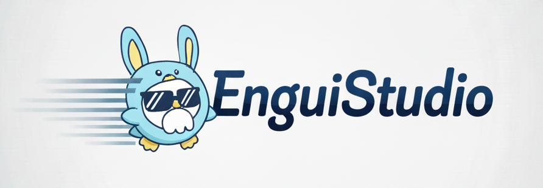

# 🚀 EnguiStudio

<div align="center">
  
  
  
  **다양한 오픈소스 AI 모델을 RunPod Serverless로 쉽게 사용할 수 있는 통합 플랫폼**
  
  *발음: 은긔 스튜디오 (/ɯnɡɯi ˈstjuːdioʊ/)*
</div>

## 🎯 프로젝트 소개

EnguiStudio는 RunPod Serverless 인프라를 활용하여 다양한 오픈소스 AI 모델들을 웹 인터페이스로 쉽게 사용할 수 있게 해주는 플랫폼입니다. 복잡한 설정 없이도 최신 AI 기술을 바로 체험해볼 수 있습니다.

## ✨ 주요 기능

- **🎬 Video Generation**: LoRA 지원이 포함된 WAN 2.2 비디오 생성 모델
  > [](https://console.runpod.io/hub/wlsdml1114/generate_video)
- **✨ FLUX KONTEXT**: 이미지 변환 및 스타일링 모델
  > [](https://console.runpod.io/hub/wlsdml1114/Flux-tontext_Runpod_hub)
- **🎨 FLUX KREA**: LoRA 지원이 포함된 고급 이미지 생성 모델
  > [](https://console.runpod.io/hub/wlsdml1114/Flux-krea_Runpod_hub)
- **🎤 MultiTalk**: Audio 2 Video 모델
  > [](https://console.runpod.io/hub/wlsdml1114/Multitalk_Runpod_hub)
- **🎭 Infinite Talk**: 이미지와 오디오를 결합한 말하는 영상 생성 모델
  > [](https://console.runpod.io/hub/wlsdml1114/InfiniteTalk_Runpod_hub)
- **📈 Video Upscale**: AI 기반 비디오 업스케일링
  > [](https://console.runpod.io/hub/wlsdml1114/upscale_interpolation_runpod_hub)
- **⚙️ Unified Settings**: RunPod 엔드포인트를 한 곳에서 관리
- **📚 Library**: 생성된 결과물과 프리셋 관리
- **💳 Credit Activity**: 사용량 및 크레딧 추적
- **☁️ S3 Storage**: 파일 관리 및 저장소
- **🎛️ Presets**: 생성 설정 저장 및 재사용

## 🛠️ 기술 스택

- **Frontend**: Next.js 15, React 19, TypeScript, Tailwind CSS
- **Backend**: Next.js API Routes, Prisma ORM
- **Database**: SQLite (개발용)
- **AI Infrastructure**: RunPod Serverless API
- **Storage**: S3-compatible storage (선택사항)
- **Authentication**: NextAuth.js (준비됨)
- **UI Components**: Radix UI, Lucide React, Heroicons
- **State Management**: SWR for data fetching
- **Package Manager**: pnpm (권장)


## 🚀 빠른 시작

### 처음 실행시킬때는 AWS s3 및 ffmpeg 다운로드 및 설치때문에 실행이 여러번 필요할 수 있습니다!

### 📺 유튜브 튜토리얼
[](https://youtu.be/-0LYseEEx4M)

### ⚡ 초간단 설치법 (권장)

EnguiStudio를 가장 쉽게 시작하는 방법:

#### Windows 사용자
1. **Node.js 다운로드**: [nodejs.org](https://nodejs.org/)에서 다운로드 (LTS 버전)
2. **프로젝트 클론**: 
   ```bash
   git clone https://github.com/wlsdml1114/Engui_Studio.git
   cd Engui_Studio
   ```
3. **설정 스크립트 실행**: `start-windows.bat` 파일을 더블클릭
   - 스크립트가 모든 것을 자동으로 처리합니다!
   - 한글이 깨져서 보인다면 `start-windows-safe.bat`를 사용하세요

#### macOS/Linux 사용자
1. **Node.js 설치**: 
   ```bash
   # macOS
   brew install node
   
   # Linux (Ubuntu/Debian)
   sudo apt install nodejs npm
   ```
2. **클론 후 실행**:
   ```bash
   git clone https://github.com/wlsdml1114/Engui_Studio.git
   cd Engui_Studio
   ./start-macos.sh
   ```

**끝!** 스크립트가 자동으로:
- ✅ Node.js 설치 확인
- ✅ 모든 의존성 설치
- ✅ 데이터베이스 설정
- ✅ 프로덕션 버전 빌드
- ✅ 프로덕션 서버 시작
- ✅ 브라우저에서 `http://localhost:3000` 열기

---

### 📋 수동 설치법 (고급 사용자)

수동 설정을 선호하거나 설치를 커스터마이징하려는 경우:

#### 사전 요구사항

시작하기 전에 다음이 설치되어 있는지 확인하세요:

##### 1. Node.js 설치
- **Windows**: [nodejs.org](https://nodejs.org/)에서 다운로드 (LTS 버전 권장)
- **macOS**: Homebrew 사용: `brew install node`
- **Linux**: 패키지 매니저 사용: `sudo apt install nodejs npm` (Ubuntu/Debian)

설치 확인:
```bash
node --version  # 18.x 이상이어야 함
npm --version   # 8.x 이상이어야 함
```

##### 2. 패키지 매니저 설치 (선택사항)
더 빠르고 효율적인 패키지 관리를 위해 `pnpm` 사용을 권장합니다:
```bash
npm install -g pnpm
```

#### 설치 단계

##### 1. 프로젝트 클론
```bash
git clone https://github.com/wlsdml1114/Engui_Studio.git
cd Engui_Studio
```

##### 2. 의존성 설치
```bash
# npm 사용
npm install

# yarn 사용
yarn install

# pnpm 사용 (권장)
pnpm install
```

##### 3. 데이터베이스 초기화
```bash
npx prisma generate
npx prisma db push
```

##### 4. 프로덕션 빌드 및 서버 시작
```bash
# 프로덕션 버전 빌드
npm run build

# 프로덕션 서버 시작
npm start

# 또는 pnpm 사용
pnpm build
pnpm start
```

##### 5. 브라우저에서 접속
브라우저를 열고 다음 주소로 이동:
```
http://localhost:3000
```

### 초기 설정

#### 1. 설정 페이지 접속
브라우저에서 `/settings` 경로로 이동

#### 2. RunPod 설정
- RunPod API 키 입력
- 각 모델별 엔드포인트 ID 설정:
  - **Video Generation** (WAN 2.2)
  - **FLUX KONTEXT** (이미지 변환)
  - **FLUX KREA** (이미지 생성)
  - **MultiTalk** (Audio 2 Video)
  - **Infinite Talk** (말하는 영상)
  - **Video Upscale** (비디오 향상)

#### 3. S3 저장소 설정 (선택사항)
- 파일 관리를 위한 S3 호환 저장소 설정
- 엔드포인트 URL, 액세스 키, 버킷 이름 설정

#### 4. 저장 및 테스트
- 모든 설정 저장
- 테스트 버튼을 사용하여 연결 확인
- 모든 서비스가 정상 작동하는지 확인

## 🔧 RunPod Serverless 설정

### 필요한 엔드포인트들
- **Video Generation**: WAN 2.2, AnimateDiff 등
- **FLUX KONTEXT**: 이미지 변환 모델
- **FLUX KREA**: 고급 이미지 생성 모델
- **MultiTalk**: Audio 2 Video 모델
- **Infinite Talk**: 이미지와 오디오를 결합한 말하는 영상 생성 모델
- **Video Upscale**: AI 기반 비디오 향상
- **기타 커스텀 모델**: 원하는 오픈소스 모델 추가 가능

### 설정 방법
1. [RunPod](https://runpod.io/)에서 원하는 모델의 Serverless 엔드포인트 생성
2. 각 엔드포인트의 ID를 설정 페이지에 입력
3. 연결 테스트로 정상 작동 확인

## 🛠️ 문제 해결

### 설정이 로드되지 않는 경우
1. **데이터베이스 초기화**: 설정 페이지에서 "🗑️ 데이터베이스 초기화" 버튼 클릭
2. **서버 재시작**: `npm run dev` 다시 실행
3. **설정 재입력**: RunPod 및 S3 설정을 다시 입력

### RunPod 연결 실패
1. **API 키 확인**: RunPod 대시보드에서 API 키가 올바른지 확인
2. **엔드포인트 ID 확인**: 각 서비스별 엔드포인트 ID가 정확한지 확인
3. **연결 테스트**: 설정 페이지에서 "테스트" 버튼으로 연결 상태 확인

### 암호화 에러가 발생하는 경우
1. **데이터베이스 초기화**: 기존 암호화된 데이터 정리
2. **서버 재시작**: 환경변수 변경 후 서버 재시작
3. **설정 재입력**: 모든 설정을 새로 입력

## 🎯 사용 가능한 기능

### 🎬 Video Generation (WAN 2.2)
- 텍스트 프롬프트로 고품질 비디오 생성
- 스타일 커스터마이징을 위한 LoRA 모델 지원
- 설정 가능한 매개변수: 너비, 높이, 시드, CFG, 길이, 스텝
- 실시간 생성 진행 상황 추적

### ✨ FLUX KONTEXT
- 기존 이미지 변환 및 스타일링
- 고급 이미지 조작 기능
- 다양한 예술적 스타일 지원

### 🎨 FLUX KREA
- 텍스트 프롬프트로 이미지 생성
- LoRA 모델 지원
- 설정 가능한 매개변수로 고품질 이미지 생성

### 🎤 MultiTalk
- 오디오를 비디오로 변환
- 오디오 입력으로 말하는 머리 비디오 생성
- 다양한 오디오 형식 지원

### 🎭 Infinite Talk
- 이미지와 오디오를 결합하여 말하는 비디오 생성
- 현실적인 말하는 머리 애니메이션 생성
- 커스텀 캐릭터 생성 지원

### 📈 Video Upscale
- AI를 사용한 비디오 품질 향상
- 비디오를 더 높은 해상도로 업스케일
- 비디오 선명도 및 세부사항 개선

### 🎛️ 프리셋 관리
- 생성 설정 저장 및 재사용
- 다양한 사용 사례를 위한 커스텀 프리셋 생성
- 다른 사용자와 프리셋 공유

### 💳 크레딧 활동
- 사용량 및 크레딧 추적
- API 사용량 및 비용 모니터링
- 상세한 활동 로그

### ☁️ S3 저장소
- 파일 관리 및 저장소
- 파일 업로드 및 다운로드
- 폴더로 파일 정리
- 다양한 파일 형식 지원

## 📋 요구사항

- **Node.js**: 18.x 이상
- **npm**: 8.x 이상
- **RunPod 계정**: AI 모델 사용을 위해 필요
- **S3 호환 스토리지**: 파일 저장을 위해 필요 (선택사항)

## 🔒 보안 주의사항

- API 키와 시크릿은 웹 인터페이스에서만 입력하고 안전하게 보관
- 로컬에서만 실행하여 개인정보를 보호
- 프로덕션 환경에서는 환경변수를 통한 설정 권장

## 🚀 개발 환경

이 애플리케이션은 최적의 성능과 사용 편의성을 위해 개발 모드에서 실행하도록 설계되었습니다:

```bash
npm run dev
```

**참고**: 이 애플리케이션은 정적 파일 서빙과 실시간 업데이트를 위한 최상의 사용자 경험을 위해 개발 모드를 사용합니다.

## 🤝 기여하기

1. **Fork** 이 프로젝트
2. **Feature branch** 생성 (`git checkout -b feature/AmazingFeature`)
3. **Commit** 변경사항 (`git commit -m 'Add some AmazingFeature'`)
4. **Push** 브랜치 (`git push origin feature/AmazingFeature`)
5. **Pull Request** 생성

## 📞 지원

문제가 발생하면:
1. 설정 페이지의 "🗑️ 데이터베이스 초기화" 버튼 사용
2. 개발 서버 재시작
3. 설정 재입력 및 연결 테스트

## 📄 라이선스

이 프로젝트는 MIT 라이선스 하에 배포됩니다. 자세한 내용은 [LICENSE](LICENSE) 파일을 참조하세요.

## 🙏 감사의 말

- [Next.js](https://nextjs.org/) - React 프레임워크
- [RunPod](https://runpod.io/) - AI 인프라 서비스
- [Prisma](https://www.prisma.io/) - 데이터베이스 ORM
- [Tailwind CSS](https://tailwindcss.com/) - CSS 프레임워크
- **오픈소스 AI 모델 커뮤니티** - 다양한 AI 모델 제공

## 🌐 언어 지원

- [English](README.md)
- [한국어](README.kr.md) (현재)

## 🔗 배너 사용하기

다른 프로젝트에서 EnguiStudio로 링크하고 싶다면 우리 배너를 사용하세요:

```markdown
[](https://github.com/wlsdml1114/Engui_Studio)
```

### 다양한 크기:
- **작은 크기**: `width="400" height="140"`
- **중간 크기**: `width="600" height="210"`
- **큰 크기**: `width="800" height="280"` (원본)
