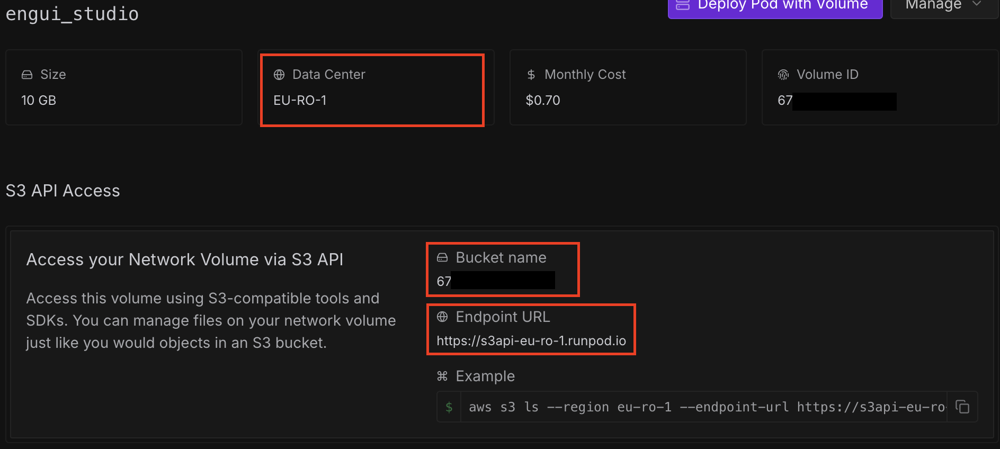

# 🚀 EnguiStudio (은긔 스튜디오)

<div align="center">
  
  
  **A unified platform for easily using various open-source AI models with RunPod Serverless**
  
  *Pronunciation: Eun-gui Studio (/ɯnɡɯi ˈstjuːdioʊ/)*
</div>

### Join our discord!

[](https://discord.gg/8Xhq9f77fK)

## 🎯 Project Overview

EnguiStudio is a platform that enables easy access to various open-source AI models through a web interface using RunPod Serverless infrastructure. Experience cutting-edge AI technology without complex setup.

<div align="center">
  <a href="https://runpod.io?ref=wvzldlmr">
    
  </a>
</div>

## ✨ Key Features & Quick Deploy

- **🎬 Video Generation**: WAN 2.2 video generation model with LoRA support
  > [](https://console.runpod.io/hub/wlsdml1114/generate_video)
- **✨ FLUX KONTEXT**: Image transformation and styling model
  > [](https://console.runpod.io/hub/wlsdml1114/Flux-tontext_Runpod_hub)
- **🎨 FLUX KREA**: Advanced image generation model with LoRA support
  > [](https://console.runpod.io/hub/wlsdml1114/Flux-krea_Runpod_hub)
- **🎤 MultiTalk**(not recommended): Audio 2 Video model
  > [](https://console.runpod.io/hub/wlsdml1114/Multitalk_Runpod_hub)
- **🎭 Infinite Talk**(recommend): Talking video generation model combining images and audio
  > [](https://console.runpod.io/hub/wlsdml1114/InfiniteTalk_Runpod_hub)
- **🎬 WAN Animate**: Advanced image-to-video animation with precise control points
  > [](https://console.runpod.io/hub/wlsdml1114/Wan_Animate_Runpod_hub)
- **📈 Video Upscale**: AI-powered video upscaling
  > [](https://console.runpod.io/hub/wlsdml1114/upscale_interpolation_runpod_hub)
- **⚙️ Unified Settings**: Manage RunPod endpoints in one place
- **📚 Library**: Manage generated results
- **☁️ S3 Storage**: File management and storage


## 🚀 Quick Start

### You may need to run the script multiple times on your first launch due to AWS S3 and ffmpeg download/installation steps!

### 📺 Youtube Tutorial
[](https://youtu.be/-0LYseEEx4M)

### ⚡ Super Easy Installation (Recommended)

The easiest way to get started with EnguiStudio:

#### Windows Users
1. **Download Node.js**: Get it from [nodejs.org](https://nodejs.org/) (LTS version)
2. **Clone the project**: 
   ```bash
   git clone https://github.com/wlsdml1114/Engui_Studio.git
   cd Engui_Studio
   ```
3. **Run the setup script**: Double-click `start-windows.bat`

#### macOS/Linux Users
1. **Install Node.js**: 
   ```bash
   # macOS
   brew install node
   
   # Linux (Ubuntu/Debian)
   sudo apt install nodejs npm
   ```
2. **Clone and run**:
   ```bash
   git clone https://github.com/wlsdml1114/Engui_Studio.git
   cd Engui_Studio
   ./start-macos.sh
   ```

**That's it!** The script will automatically:
- ✅ Check Node.js installation
- ✅ Install all dependencies
- ✅ Set up the database
- ✅ Build the production version
- ✅ Start the production server
- ✅ Open your browser to `http://localhost:3000`


## Initial Setup

#### 1. Access Settings Page
Navigate to `/settings` in your browser

#### 2. Configure RunPod
- Enter your RunPod API key
  - You can get your RunPod API key from [here](https://console.runpod.io/user/settings)
- Configure endpoint IDs for each model:
  - You can get your RunPod endpoint IDs from [here](https://console.runpod.io/serverless)
    - **Video Generation** (WAN 2.2)
    - **FLUX KONTEXT** (Image transformation)
    - **FLUX KREA** (Image generation)
    - **MultiTalk** (Audio 2 Video)
    - **Infinite Talk** (Talking video)
    - **WAN Animate** (Image-to-video animation)
    - **Video Upscale** (Video enhancement)
    - **Example**
    

#### 3. Configure S3 Storage (Recommended)
- Set up S3-compatible storage for file management
- Configure endpoint URL, access keys, and bucket name in your network volume.
- Also you need to create s3 API key to generate access key id and secret access key.
- **In network volume**

- **In s3 API key**


#### 4. Save and Test
- Save all settings
- Test connections using the test buttons
- Verify all services are working correctly

## 🔒 Security Notes

- Enter API keys and secrets only through web interface and store safely
- Run locally only to protect personal information
- Recommend environment variable configuration for production

## 📄 License

This project is distributed under the MIT License. See the [LICENSE](LICENSE) file for details.

## 🙏 Acknowledgments

- [Next.js](https://nextjs.org/) - React framework
- [RunPod](https://runpod.io/) - AI infrastructure service
- [Prisma](https://www.prisma.io/) - Database ORM
- [Tailwind CSS](https://tailwindcss.com/) - CSS framework
- **Open Source AI Model Community** - Providing various AI models

## 🌐 Language Support

- [English](README.md) (Current)
- [한국어](README.kr.md)

## 🔗 Use Our Banner

Want to link to EnguiStudio from your project? Use our banner:

```markdown
[](https://github.com/wlsdml1114/Engui_Studio)
```

### Different Sizes:
- **Small**: `width="400" height="140"`
- **Medium**: `width="600" height="210"`
- **Large**: `width="800" height="280"` (original)